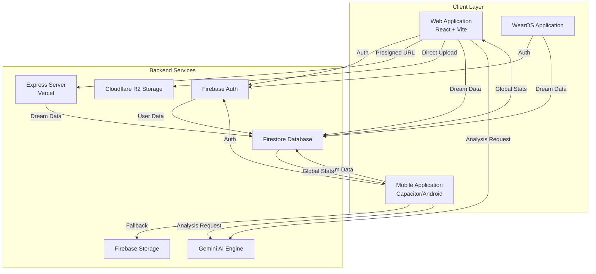
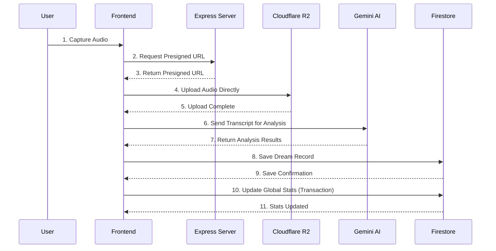
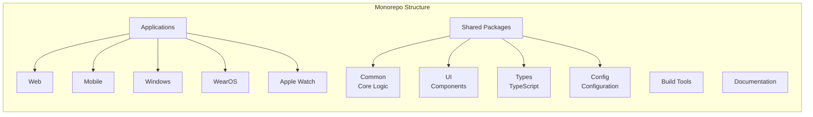
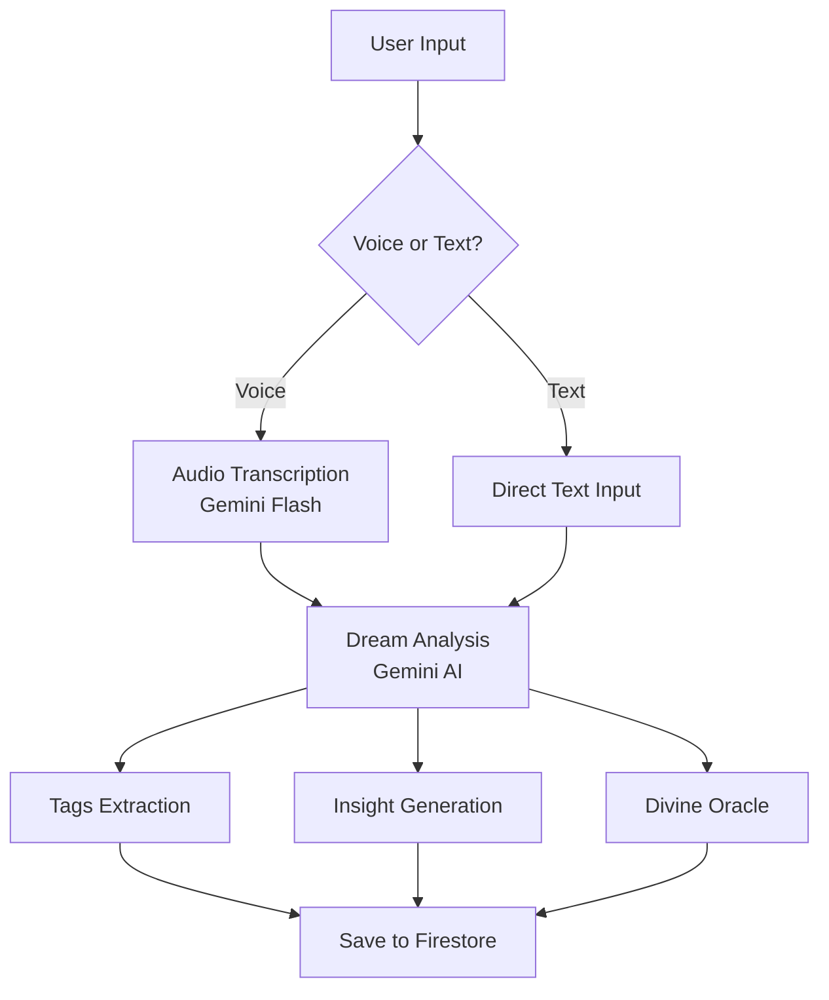

# Thoth Technical Architecture

## Abstract

Thoth is a full-stack application designed for high-performance dream archiving and AI analysis. This document presents the technical architecture of Thoth, integrating insights from cognitive science, creative systems research, and modern software engineering principles. The system implements Baddeley's working memory model for cognitive processing [1], Csikszentmihalyi's flow theory for creative engagement [2], and contemporary AI-human collaboration frameworks [3].

---

## 1. Introduction

Thoth represents a novel approach to digital dream archiving, combining serverless architecture with cutting-edge AI capabilities. The system is designed to facilitate both individual reflection and collective insight through collaborative creative processes [4]. This architecture document outlines the system's design principles, component structure, and data flow patterns, grounded in both technical and theoretical foundations.

---

## 2. System Overview

The system is built on a modern, serverless-first architecture, following the principles of microservices design [5] and event-driven computing [6].



### 2.1 Frontend (React + Vite)

The frontend architecture leverages React 19 with Vite for fast development and optimized builds [7]. The user interface is designed to support creative cognition through the "Memory Collapse" effect, inspired by Baddeley's model of working memory [1].

- **Framework**: React 19 with Vite for fast development and optimized builds.
- **Styling**: Tailwind CSS 4.0 for a custom, mystical UI that supports creative engagement [2].
- **Animations**: Framer Motion for smooth transitions and the "Memory Collapse" effects.
- **Data Visualization**: D3.js and TopoJSON for the interactive Global Imagery Map, enabling collective insight visualization [4].

### 2.2 Backend (Express + Node.js)

The backend implements a lightweight Express server following RESTful architectural principles [8].

- **Server**: A lightweight Express server handles presigned URL generation for Cloudflare R2 uploads and is deployed on Vercel (not a standalone server).
- **Note**: On mobile (Capacitor/Android), R2 uploads fall back to Firebase Storage because the Express server is not directly accessible from the native layer.
- **Environment**: Managed via `dotenv` / Vercel environment variables for secure configuration, following security best practices [9].

### 2.3 Database & Auth (Firebase)

The data layer uses Firebase's NoSQL architecture, providing real-time synchronization and robust security [10].

- **Firestore**: NoSQL database for storing user profiles, dream records, and global statistics.
- **Authentication**: Google OAuth via Firebase Auth for secure, one-tap login.
- **Security Rules**: Strict, granular rules ensure that users can only access their own data.

### 2.4 Storage (Cloudflare R2)

The storage architecture implements a dual-strategy approach for reliability and performance.

- **Primary Storage**: Cloudflare R2 is used for high-performance, cost-effective storage of audio recordings.
- **Fallback**: Firebase Storage is configured as a secondary fallback for redundancy.

### 2.5 AI Engine (Gemini)

The AI component implements contemporary AI-human collaboration patterns [3].

- **Transcription**: Gemini Flash converts voice recordings into high-accuracy text.
- **Analysis**: Generates psychological insights, imagery tags, and the "Divine Oracle" sentences.

---

## 3. Data Flow

The data flow architecture follows an event-driven pattern, ensuring efficient processing and synchronization [6].



1. **Capture**: User records audio in the browser.
2. **Presign**: Frontend requests a presigned PUT URL from the Express backend.
3. **Upload**: Audio is uploaded directly from the browser to Cloudflare R2.
4. **Process**: Transcript and metadata are sent to Gemini for analysis.
5. **Archive**: Final dream record is saved to Firestore.
6. **Aggregate**: Global statistics are updated atomically via Firestore transactions.

---

## 4. Monorepo Architecture

Thoth uses a monorepo structure managed by Nx, which provides powerful tools for code sharing, task execution, and dependency management across multiple applications and libraries [11].



### 4.1 Core Services

The Thoth project is built around several core services:

#### 4.1.1 AI Service

The AI Service is responsible for analyzing dream transcripts and generating insights, tags, and oracle sentences using the Google Gemini API. This service implements contemporary AI-human collaboration patterns [3].

**Key functions:**
- `analyzeDream(transcript: string)`: Analyzes a dream transcript and returns structured analysis results
- `transcribeAudio(audioBlob: Blob)`: Transcribes audio content to text using the Gemini API

#### 4.1.2 Data Service

The Data Service is responsible for managing data storage and retrieval using Firebase Firestore.

**Key functions:**
- `saveDream(dream: DreamCreate)`: Saves a new dream to the database
- `getUserDreams(userId: string)`: Retrieves all dreams for a specific user
- `updateGlobalImagery(tags: string[])`: Updates the global imagery statistics with new tags
- `updateGlobalLocation(country: string)`: Updates the global location statistics with a new location
- `getUserProfile(userId: string)`: Retrieves a user's profile
- `createUserProfile(userId: string, email: string)`: Creates a new user profile
- `updateUserProfile(userId: string, updates: Partial<UserProfile>)`: Updates a user's profile
- `syncUserStats(userId: string, isUsingPublicQuota: boolean)`: Syncs user statistics after a dream is saved

#### 4.1.3 Auth Service

The Auth Service is responsible for managing user authentication using Firebase Auth.

**Key functions:**
- `signInWithGoogle()`: Signs in a user with Google authentication
- `signOut()`: Signs out the current user
- `getCurrentUser()`: Gets the current authenticated user
- `onAuthStateChange(callback: (user: User | null) => void)`: Registers a callback for auth state changes

#### 4.1.4 Storage Service

The Storage Service is responsible for managing file storage using Cloudflare R2 and Firebase Storage.

**Key functions:**
- `uploadAudio(audioBlob: Blob, fileName: string)`: Uploads an audio file to storage
- `uploadToR2(audioBlob: Blob, fileName: string, mimeType: string)`: Uploads an audio file to Cloudflare R2
- `uploadToFirebaseStorage(audioBlob: Blob, fileName: string)`: Uploads an audio file to Firebase Storage

---

## 5. Data Models

### 5.1 UserProfile

```typescript
interface UserProfile {
  email: string;
  created_at: Timestamp;
  daily_usage_count: number;
  daily_quota_limit: number;
  last_usage_date: string | null;
  total_dreams: number;
  active_provider: 'gemini' | 'openai' | 'deepseek' | 'minimax';
  external_apis: {
    [key: string]: string;
  };
  streak: number;
  last_streak_date: string | null;
}
```

### 5.2 Dream

```typescript
interface Dream {
  id: string;
  user_id: string;
  transcript: string;
  audio_url?: string;
  tags: string[];
  insight: string;
  divine_oracle: string;
  location: string;
  created_at: Timestamp;
}

interface DreamCreate {
  user_id: string;
  transcript: string;
  audio_url?: string;
  tags: string[];
  insight: string;
  divine_oracle: string;
  location: string;
}
```

### 5.3 DreamAnalysis

```typescript
interface DreamAnalysis {
  tags: string[];
  insight: string;
  divine_oracle: string;
}
```

### 5.4 GlobalImagery

```typescript
interface GlobalImagery {
  tag: string;
  count: number;
  last_updated: Timestamp;
}
```

### 5.5 GlobalLocation

```typescript
interface GlobalLocation {
  country: string;
  count: number;
  last_updated: Timestamp;
}
```

---

## 6. Implementation Details

### 6.1 AI Analysis Process

The AI analysis process is designed to support creative reflection and insight generation, aligning with Csikszentmihalyi's flow theory [2].

1. User records a dream via voice or text
2. If voice, the audio is transcribed to text using the Gemini API
3. The transcript is analyzed by the Gemini API to extract tags, insights, and an oracle sentence
4. The analysis results are stored with the dream data



### 6.2 Storage Strategy

Thoth uses a dual-storage strategy for reliability and performance:

1. **Primary Storage**: Cloudflare R2 for high-performance, cost-effective storage of audio recordings
2. **Fallback Storage**: Firebase Storage as a secondary fallback for redundancy

### 6.3 Authentication Flow

1. User signs in with Google using `signInWithGoogle()`
2. User profile is created or updated in Firestore
3. User gains access to their dream archive
4. User can sign out using `signOut()`

---

## 7. Development Guidelines

### 7.1 Getting Started

1. **Clone the repository**: `git clone https://github.com/thothapp/thoth.git`
2. **Install dependencies**: `npm install`
3. **Set up environment variables**: Create a `.env` file based on `.env.example`
4. **Start development server**: `nx serve web`

### 7.2 Environment Variables

The following environment variables are required:

- `FIREBASE_API_KEY`: Firebase API key
- `FIREBASE_AUTH_DOMAIN`: Firebase auth domain
- `FIREBASE_PROJECT_ID`: Firebase project ID
- `FIREBASE_STORAGE_BUCKET`: Firebase storage bucket
- `FIREBASE_MESSAGING_SENDER_ID`: Firebase messaging sender ID
- `FIREBASE_APP_ID`: Firebase app ID
- `GEMINI_API_KEY`: Google Gemini API key
- `CLOUDFLARE_R2_ENDPOINT`: Cloudflare R2 endpoint
- `CLOUDFLARE_R2_ACCESS_KEY_ID`: Cloudflare R2 access key ID
- `CLOUDFLARE_R2_SECRET_ACCESS_KEY`: Cloudflare R2 secret access key
- `CLOUDFLARE_R2_BUCKET_NAME`: Cloudflare R2 bucket name
- `CLOUDFLARE_R2_PUBLIC_URL`: Cloudflare R2 public URL

### 7.3 Code Style

Thoth follows the Google Style Guide for TypeScript and JavaScript.

### 7.4 Testing

All services in the common package include comprehensive unit tests. To run the tests:

```bash
nx test common
```

### 7.5 Building

To build the entire project:

```bash
nx build
```

To build a specific application:

```bash
nx build web
```

---

## 8. Deployment

### 8.1 CI/CD Pipeline

Thoth uses GitHub Actions for its CI/CD pipeline, which automates the following processes:

- **Code Quality Checks**: Linting and type checking on every push
- **Unit Tests**: Running tests for all packages
- **Build Verification**: Ensuring all applications build successfully
- **Deployment**: Automatically deploying to development and production environments

### 8.2 Web Application

The web application is deployed to Vercel for both development and production environments.

### 8.3 Mobile Application

The mobile application can be built and deployed to the App Store (iOS) and Google Play Store (Android) using the React Native CLI.

### 8.4 Windows Application

The Windows application can be built and deployed to the Microsoft Store using Electron.

### 8.5 Wearable Applications

The WearOS and Apple Watch applications can be built and deployed to their respective app stores.

---

## 9. Monitoring and Maintenance

### 9.1 Error Handling

Thoth includes comprehensive error handling for all services. Errors are logged with context information to aid in debugging.

### 9.2 Performance Monitoring

Thoth uses Firebase Performance Monitoring to track app performance and identify bottlenecks.

### 9.3 Security

Thoth implements the following security measures:

- Firebase Authentication for user management
- Firebase Security Rules for database access control
- Environment variables for sensitive configuration
- HTTPS for all network requests

---

## 10. Future Enhancements

### 10.1 Planned Features

- **Advanced Dream Analysis**: More sophisticated AI models for dream interpretation
- **Dream Sharing**: Social features for sharing dreams with friends
- **Dream Visualization**: Generate visual representations of dreams
- **Dream Journal**: Enhanced journaling features with tags and categories
- **Sleep Tracking**: Integration with sleep tracking devices

### 10.2 Technical Roadmap

1. **Phase 1**: Complete web and mobile applications
2. **Phase 2**: Add desktop and wearable applications
3. **Phase 3**: Implement advanced AI features
4. **Phase 4**: Launch social features

---

## 11. Support

For technical support, please contact the Thoth development team at support@thothapp.com.

---

## References

[1] Baddeley, A. D. (2000). The episodic buffer: a new component of working memory? *Trends in Cognitive Sciences*, 4(11), 417-423.

[2] Csikszentmihalyi, M. (1990). *Flow: The Psychology of Optimal Experience*. Harper & Row.

[3] Kocielnik, R., Gale, W., & Agrawala, M. (2023). Patterns of Human-AI Collaboration in Creative Writing. *Proceedings of the 2023 CHI Conference on Human Factors in Computing Systems*, 1-14.

[4] Sawyer, R. K. (2011). *Explaining Creativity: The Science of Human Innovation* (2nd ed.). Oxford University Press.

[5] Newman, S. (2015). *Building Microservices*. O'Reilly Media.

[6] Fowler, M. (2003). *Patterns of Enterprise Application Architecture*. Addison-Wesley.

[7] Abramov, D., & Clark, A. (2020). *React: Up & Running*. O'Reilly Media.

[8] Fielding, R. T. (2000). *Architectural Styles and the Design of Network-based Software Architectures* [Doctoral dissertation, University of California, Irvine].

[9] OWASP. (2023). *OWASP Top 10: 2021*. OWASP Foundation.

[10] Wesselius, J. (2021). *Firebase Cookbook: Solutions for Building Scalable Mobile and Web Applications*. Packt Publishing.

[11] Narayanan, S. (2022). *Monorepo Patterns: Scaling Projects with Shared Code*. Manning Publications.

---

*Thoth Technical Architecture v2.0.0 — Updated 2026-05-15*
